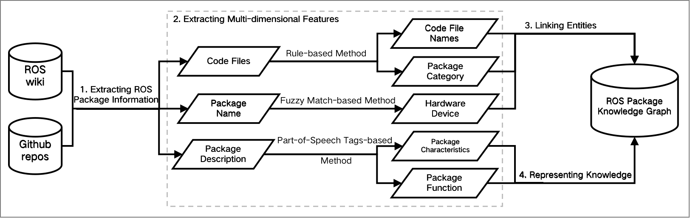
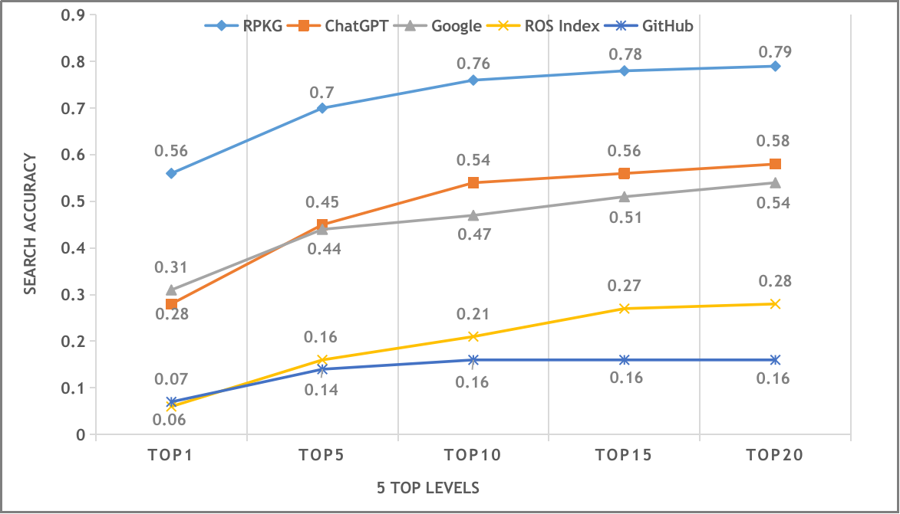

# RPKG(ROS Package Knowledge Graph)

[](https://opensource.org/licenses/Apache-2.0)


implementation of the paper [Recommending ROS Packages for Robot Task by Knowledge Graph](https://arxiv.org/abs/2312.14781) presented in arxiv. 

## Method Overview
### High-level Abstraction of ROS Packages

### RPKG Construction

### RPKG-based ROS Package Search


## Evaluation



## Installation
Here are some instructions to help you get RPKG deployed in your machine. These instructions assume that you already have a **working installation of Neo4j**.
RPKG has been tested with *Linux Ubuntu 16.04*, *Linux Ubuntu 18.04* and *MacOS 13.3*.
These setups should provide you with most of the basic dependencies of RPKG, namely **Python 3.7+** and **Neo4j 4.4+**.

1. Install [Neo4j](https://neo4j.com/deployment-center/).
2. Download the codes into local machine:
```bash
git clone https://github.com/iwangshuo/RPKG.git
```
3. Install other dependencies:

```bash
cd RPKG/
pip install -r requirements.txt
```

## Tutorials
**1. Extracting ROS Package Information**

```bash
python package_information/crawl_robot.py
```
this step will generate csv files into data/ folder. 

**2. Extracting Multi-dimensional Features**

    extract features on code files, function and characteristics.
```bash
python feature_extraction/feature_extractor.py
```

extract features on robot and sensor.

```bash
python feature_extraction/hardware_feature_extractor.py
```
this step will generate csv files into data/output/ folder.

**3. Representing ROS Package Knowledge**
    
further train [Bert](https://github.com/google-research/bert). In practice, we choose [bert-base-uncased model]((https://huggingface.co/bert-base-uncased)) for further training.
```bash
python knowledge_representation/further_train_bert.py
```

**4. Creating Database and Importing Data**

create a new database in Neo4j and import data from data/folder.
```bash
python neo4j/run_neo4j_import_data.py
```

**5. RPKG-based ROS Package Search**

search ROS packages with user queries
```bash
python package_retrieval/run_search.py
```

**6. Evaluation**

   *6.1 ChatGPT*

prompt [ChatGPT](https://chat.openai.com/) to recommend ROS packages.

```bash
cd evaluation/chatgpt
python ./RunChatGPT_evaluation_search.py --code_dir ../user_queries_chatgpt.csv --log_dir ../log/test_package_search_0_10.log --output_dir search_result --start 0 --end 1
```

analyze the accuracy of recommended ROS packages and time cost.
    
```bash
python analyze_results_chatgpt.py
python chatgpt_log_parser.py
```
   
   *6.2 GitHub*

use [Github](https://github.com/) to search ROS packages manually.

   *6.3 Google*

use [Google](https://google.com/) to search ROS packages manually.

   *6.4 ROS Index*

use [ROS Index](https://index.ros.org/) to search ROS packages semi-automatically.
For quickly acquire and analyze the search results, we deploy ROS Index in our local machine with GitHub repository [index.ros.org](https://github.com/ros-infrastructure/index.ros.org)

```bash
cd evaluation/rosindex
python analyze_results_rosindex.py
```
   
   *6.5 RPKG-based Search Method*

- analyze search accuracy
```bash
cd evaluation/rpkg
python NDCG.py --rank_input_dir ./all_results.csv --acc_output_dir ./accuracy/acc.csv
```

- ablation experiments
```bash
python package_retrieval/run_search.py
cd evaluation/rpkg
python NDCG.py --rank_input_dir ./ablation_experiments/data/xxx_feature_necessity.csv --acc_output_dir ./ablation_experiments/data/xxx_acc.csv
```
    
- solidity validation
```bash
cd evaluation/rpkg/solidity_validation
python ./solid_validation.py --rank_input_dir ../all_results.csv --acc_output_dir ./solid_result.csv
```

## Citation
If you find our work useful in your research, please consider citing our paper:
```
@misc{wang2023ros,
      title={ROS package search for robot software development: a knowledge graph-based approach}, 
      author={Shuo Wang and Xinjun Mao and Shuo Yang and Menghan Wu and Zhang Zhang},
      year={2023},
      eprint={2312.14781},
      archivePrefix={arXiv},
      primaryClass={cs.SE}
}
```
## Questions

If you have any questions, please contact "iwangshuo@qq.com".


